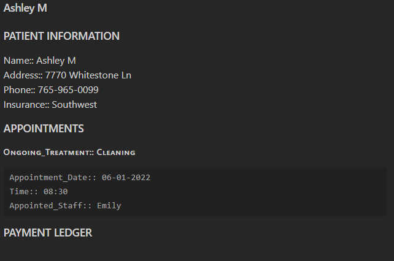

# SQL_Demo_Obsidian
## Small project showcasing my general knowledge of SQL using Obsidian Dataview.
The Project is a demo of SQL calls in a domain of a dental firm and does record calls and basic arithmetic, and is a simple visualization of how an administrator would see all the data of all the general tasks in the office.

This would be the main dashboard that would open when the user access the database

Here is a SQL query with regards of patient treatment information, with what is going on, and who is treating them at what time. There is also a link to the patient record itself to see who is there insurance company and how much they will cover.

This is a demo of staff records and who are their patients and when.
# See for yourself!
1. You need to download obsidian, a markdown text organizer. https://obsidian.md/ it is completely free.
2. Download SQL DEMO folder
3. Open Obsidian and Open the SQL DEMO
4. And you are free to explore and change records and see how they will update.
